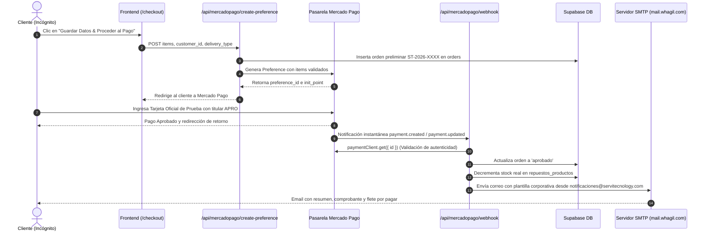

# Guía Oficial de Tarjetas de Prueba & Simulación de Pagos en Mercado Pago (Chile)

Esta guía documenta los datos oficiales proporcionados por el panel de desarrolladores de **Mercado Pago Chile** para la aplicación `Servitecnology-eCommerce` (App ID: `3244293161655961`), junto con las instrucciones para simular estados de pago (aprobado, pendiente, rechazado) en el entorno de desarrollo y pruebas (Sandbox).

---

## ⚠️ Regla de Oro para Pruebas en Sandbox

> [!IMPORTANT]
> **No utilices tu cuenta real personal de Mercado Libre / Mercado Pago:**
> Mercado Pago **bloqueará la transacción** con el error *"Una de las partes con la que intentas hacer el pago es de prueba"* si intentas pagarle a un vendedor de prueba usando tu cuenta personal real, o si intentas comprarte a ti mismo con la misma cuenta de desarrollador.

### Cómo realizar la prueba correctamente:
1. Abre tu navegador en una **Ventana de Incógnito / Pestaña Privada** (para evitar que tome cookies de tu cuenta personal de Mercado Libre).
2. En el formulario de `/checkout`, utiliza el **Usuario Comprador de Pruebas** oficial creado para esta aplicación (o un correo de prueba como `test_user_...`):
   * **Email de prueba:** `test_user_4386276905329265909@testuser.com`
   * **Contraseña (si Mercado Pago solicita inicio de sesión):** `evA1cLVqLf`
   * **Usuario:** `TESTUSER4386276905329265909`
3. Agrega los repuestos en `/repuestos` y ve al `/checkout`.
4. Completa los datos de envío y haz clic en **Guardar Datos & Proceder al Pago**.
5. En la pantalla de Mercado Pago, selecciona **"Pagar con tarjeta de crédito o débito"**.
6. Ingresa una de las tarjetas de prueba oficiales que se detallan a continuación.

---

## 🔍 ¿Por qué ocurría el error "UNDEFINED SOURCE" y "No pudimos procesar tu pago"?
1. **Redirección a Producción (`init_point`) en lugar de Sandbox (`sandbox_init_point`):**  
   Mercado Pago genera dos URLs de pago: `init_point` (para producción real) y `sandbox_init_point` (`https://sandbox.mercadopago.cl/...`).  
   Si se intenta usar una tarjeta de prueba ficticia en el entorno de producción (`init_point`), la red bancaria chilena no reconoce el banco emisor de la tarjeta y muestra **`UNDEFINED SOURCE`**. Al hacer clic en "Pagar", el motor antifraude rechaza la transacción con *"No pudimos procesar tu pago"*.
2. **Cruce entre Cuenta Personal Real y Vendedor de Pruebas:**  
   Si en el formulario del checkout se ingresa un correo personal real (por ejemplo `@gmail.com` asociado a tu cuenta de Mercado Libre), Mercado Libre vincula la sesión y bloquea la operación porque las políticas de Mercado Pago impiden que usuarios reales operen con credenciales de prueba. Se debe utilizar siempre el **Comprador de Pruebas** (`test_user_...@testuser.com`).

---

## 💳 Tarjetas de Prueba Oficiales (Chile)

| Tipo de Tarjeta | Número de Tarjeta | Código de Seguridad (CVV) | Fecha de Caducidad |
| :--- | :--- | :---: | :---: |
| **Mastercard Crédito** | `5416 7526 0258 2580` | `123` | `11/30` |
| **Visa Crédito** | `4168 8188 4444 7115` | `123` | `11/30` |
| **American Express** | `3757 781744 61804` | `1234` | `11/30` |
| **Mastercard Débito** | `5241 0198 2664 6950` | `123` | `11/30` |
| **Visa Débito** | `4023 6535 2391 4373` | `123` | `11/30` |

---

## 🎯 Simulación de Estados de Pago (Nombre del Titular)

Mercado Pago permite simular diferentes escenarios de respuesta (aprobación, saldo insuficiente, tarjeta vencida, etc.) **según el nombre del titular** que ingreses en el formulario:

| Nombre del Titular | Resultado Simulado | Documento de Identidad (RUT / Otro) | Comportamiento en Servitecnology |
| :---: | :--- | :---: | :--- |
| **`APRO`** | **Pago aprobado** ✅ | `123456789` (o RUT válido) | Webhook actualiza orden a `aprobado`, descuenta stock real en `repuestos_productos` y envía correo desde `notificaciones@servitecnology.com`. |
| **`CONT`** | **Pendiente de pago** ⏳ | Cualquiera | Orden queda en estado `pendiente`. No se descuenta stock hasta confirmación. |
| **`FUND`** | **Rechazado por fondos insuficientes** ❌ | Cualquiera | La pasarela notifica rechazo por saldo insuficiente. |
| **`SECU`** | **Rechazado por código de seguridad inválido** ❌ | Cualquiera | Simula error de CVV. |
| **`EXPI`** | **Rechazado por fecha de vencimiento** ❌ | Cualquiera | Simula tarjeta expirada. |
| **`CALL`** | **Rechazado con validación para autorizar** ❌ | Cualquiera | Simula retención por parte del banco emisor. |
| **`FORM`** | **Rechazado por error en formulario** ❌ | Cualquiera | Simula error de tipeo o validación de campos. |
| **`OTHE`** | **Rechazado por error general** ❌ | Cualquiera | Simula caída o rechazo genérico de pasarela. |

---

## 👤 Cuenta de Prueba Comprador (*Test User*)

Si requieres probar el inicio de sesión como usuario registrado en lugar de pagar como invitado:

- **Usuario / Email:** `TESTUSER2887970320255947564`
- **Contraseña:** `zGew8fijBV`
- **Código de verificación (2FA):** `788543`

---

## 🔄 Flujo Completo de Conciliación y Webhooks

