# 🚀 Playbook Maestro: Integración de Pagos con Mercado Pago en SaaS y E-Commerce
## Guía de Arquitectura, Prevención de Errores Críticos, Webhooks e Idempotencia (Edición Definitiva)

> **Autor:** Equipo de Ingeniería SERVITECNOLOGY  
> **Ubicación:** `docs/DesarrolloEcommerce/playbook-maestro-mercadopago-saas.md`  
> **Propósito:** Guía de referencia técnica para implementar pasarelas de pago con Mercado Pago (Checkout Pro y Webhooks) en cualquier SaaS o plataforma web moderna (Astro, Next.js, Remix, SvelteKit, Express, Fastify) sin repetir los errores, bloqueos y trampas comunes del entorno Sandbox y Producción.

---

## 📑 Tabla de Contenidos
1. [Arquitectura General del Flujo de Pago](#1-arquitectura-general-del-flujo-de-pago)
2. [API de Preferences (Legacy) vs API de Orders (Nueva API Oficial)](#2-api-de-preferences-legacy-vs-api-de-orders-nueva-api-oficial)
3. [El Muro de los Horrores: 10 Errores Críticos que Debes Evitar](#3-el-muro-de-los-horrores-10-errores-críticos-que-debes-evitar)
4. [Separación de Entornos y Variables (Servidor vs Base de Datos)](#4-separación-de-entornos-y-variables-servidor-vs-base-de-datos)
5. [Diseño del Modelo de Datos (PostgreSQL / Supabase / Prisma)](#5-diseño-del-modelo-de-datos-postgresql--supabase--prisma)
6. [Implementación Técnica de Código (Clean Architecture)](#6-implementación-técnica-de-código-clean-architecture)
   - 6.1 [Cliente SDK Resiliente (`mercadopago.ts`)](#61-cliente-sdk-resiliente-mercadopagots)
   - 6.2 [Creación de Preferencias Anti-Fraude (`create-preference.ts` - Preferences API)](#62-creación-de-preferencias-anti-fraude-create-preferencets---preferences-api)
   - 6.3 [Creación de Orden Anti-Fraude con la Nueva API de Orders (`create-order.ts` - Orders API)](#63-creación-de-orden-anti-fraude-con-la-nueva-api-de-orders-create-orderts---orders-api)
   - 6.4 [Webhook de Conciliación Idempotente (`webhook.ts`)](#64-webhook-de-conciliación-idempotente-webhookts)
   - 6.5 [Liberación Inmediata de Stock Cancelado (`cancel-attempt.ts`)](#65-liberación-inmediata-de-stock-cancelado-cancel-attemptts)
   - 6.6 [Sincronización en Vivo de Stock en Carrito (`validate-stock.ts`)](#66-sincronización-en-vivo-de-stock-en-carrito-validate-stockts)
7. [Guía de Pruebas en Sandbox Chile (MLC) y Latam](#7-guía-de-pruebas-en-sandbox-chile-mlc-y-latam)
8. [Experiencia de Usuario (UI/UX) y Cumplimiento Legal](#8-experiencia-de-usuario-uiux-y-cumplimiento-legal)
9. [Checklist Definitivo de Pase a Producción](#9-checklist-definitivo-de-pase-a-producción)

---

## 1. Arquitectura General del Flujo de Pago

El flujo de integración con Mercado Pago Checkout Pro sigue un modelo asíncrono de **doble confirmación**:
1. **Frontend / Cliente:** Solicita la intención de pago; el servidor valida y genera la preferencia con `external_reference`.
2. **Pasarela Mercado Pago:** Procesa la transacción en su entorno seguro (aislamiento de tarjetas PCI-DSS).
3. **Webhook Asíncrono (Servidor a Servidor):** Es la **ÚNICA** fuente de verdad que autoriza el despacho, descuenta stock y envía comprobantes oficiales.

```mermaid
sequenceDiagram
    autonumber
    actor Comprador as Comprador (Web)
    participant Frontend as Frontend (Checkout / Carrito)
    participant API as Backend API (/create-preference)
    participant DB as Base de Datos (Orders / Inventory)
    participant MP as Mercado Pago API (Checkout Pro)
    participant Webhook as Backend API (/webhook)
    participant Mail as Servicio de Email (SMTP / Resend)

    Comprador->>Frontend: Clic en "Pagar con Mercado Pago"
    Note over Frontend: Carrito permanece en LocalStorage (NO borrar aún)
    Frontend->>API: POST { items: [{ sku, qty }], customer }
    
    rect rgb(20, 25, 35)
        Note over API,DB: VALIDACIÓN ESTRICTA ANTI-FRAUDE
        API->>DB: Consulta precios reales e inventario de cada SKU
        API-->>Frontend: Error si precio manipulado o stock insuficiente
        API->>DB: Crea orden preliminar 'ST-XXXX' (payment_status: 'pendiente')
        API->>MP: Preference.create({ items, payer, back_urls, external_reference })
        MP-->>API: Retorna { id, init_point }
        API->>DB: Guarda mp_preference_id en la orden
        API-->>Frontend: Retorna URL de pago segura (init_point)
    end

    Frontend->>MP: Redirige al Comprador a Mercado Pago
    Comprador->>MP: Ingresa medio de pago y confirma

    alt Caso A: Pago Aprobado
        MP-->>Frontend: Redirige a back_urls.success (?payment=success)
        Frontend->>Frontend: Limpia carrito de LocalStorage (clearCart)
        Frontend-->>Comprador: Muestra pantalla de confirmación exitosa
        
        par Procesamiento en Segundo Plano (Garantizado)
            MP->>Webhook: POST notificación { type: 'payment', data: { id } }
            Webhook->>MP: Payment.get({ id }) (Verifica autenticidad)
            Webhook->>DB: IDEMPOTENCIA: ¿Ya estaba aprobada? Si sí -> 200 OK
            Webhook->>DB: UPDATE order SET payment_status='aprobado', mp_payment_id
            Webhook->>DB: Descuenta stock definitivo de inventario
            Webhook->>Mail: Envía correo con comprobante y detalle de compra
            Webhook-->>MP: HTTP 200 OK
        end

    else Caso B: Pago Rechazado o Cliente Cancela (Clic en Volver)
        MP-->>Frontend: Redirige a back_urls.failure (?payment=failure&order=ST-XXXX)
        Note over Frontend: ¡El carrito sigue intacto con sus repuestos!
        Frontend->>API: POST /api/mercadopago/cancel-attempt { order_id }
        API->>DB: UPDATE order SET payment_status='cancelado', libera stock reservado
        Frontend-->>Comprador: Modal informativo: "Pago no completado, intenta con otro medio"
    end
```



---

## 2. API de Preferences (Legacy) vs API de Orders (Nueva API Oficial)

Cuando creas una aplicación en el **Panel de Desarrolladores de Mercado Pago** (`developers.mercadopago.cl/panel/app/create-app`), el asistente te presenta un selector crítico:

> [!WARNING]
> **Aviso Oficial de Mercado Pago en el Panel:**  
> - Si seleccionas **`API de Preferences`**: Aparece en rojo la advertencia:  
>   `⚠️ Esta API será descontinuada pronto.`  
> - Si seleccionas **`API de Orders`**: Es la opción oficial, moderna y recomendada para todas las nuevas aplicaciones.

### ¿Por qué Mercado Pago descontinúa la API de Preferences?
Mercado Pago históricamente mantenía APIs dispersas para cada caso de uso: Preferences para Checkout Pro web, Merchant Orders para QR físico y Payment API para cobros directos. Con la **API de Orders** (`/v1/orders`), Mercado Pago unificó el ciclo de vida completo de la transacción (creación, consulta, cancelación, reembolsos e idempotencia nativa) en un solo recurso omnicanal.

### Tabla Comparativa: ¿Cuál usar en tu SaaS?

| Característica | API de Preferences (Legacy) | API de Orders (Nueva y Oficial) |
| :--- | :--- | :--- |
| **Estado de Soporte** | ⚠️ **En proceso de obsolescencia** (No recomendada para nuevos SaaS) | ✅ **Oficial y Activa** (Recomendada para todo nuevo proyecto) |
| **Endpoint REST** | `POST https://api.mercadopago.com/checkout/preferences` | `POST https://api.mercadopago.com/v1/orders` |
| **SDK Node.js** | `import { Preference } from 'mercadopago'` | `POST /v1/orders` directo con `fetch` o SDK v2 Orders |
| **Header de Idempotencia** | Opcional | **Obligatorio:** `X-Idempotency-Key: <UUID>` |
| **Identificador Retornado** | `id` de preferencia (ej: `123456789-abcd-...`) | `id` de order (ej: `ORDTST01KS5AJ6HTK...`) |
| **URL de Pago al Comprador** | `init_point` y `sandbox_init_point` | `checkout_url` |
| **URLs de Retorno** | `back_urls: { success, failure, pending }` | `config.online.callback_urls: { return, cancel }` |
| **Retorno Automático** | `auto_return: 'approved'` | `config.online.auto_return: { allowed: true }` |
| **¿Dónde está en Servitecnology?** | Implementada en `landingpage` (creada antes del aviso) | **Obligatoria para cualquier nueva aplicación** |

---

## 3. El Muro de los Horrores: 10 Errores Críticos que Debes Evitar

| # | Error o Trampa Frecuente | Causa Raíz | Solución Probada y Certificada |
| :--- | :--- | :--- | :--- |
| **1** | **Bucle infinito de redirecciones (`ERR_TOO_MANY_REDIRECTS`)** | Usar `sandbox_init_point` (`https://sandbox.mercadopago.cl/...`) en vez de `init_point`. Mercado Pago en versiones recientes redirige entre subdominios en bucle. | Utilizar siempre `mpResponse.init_point || mpResponse.sandbox_init_point`. La URL de `init_point` reconoce internamente si el token es de prueba o producción sin ciclar. |
| **2** | **"Una de las partes con la que intentas hacer el pago es de prueba"** | Enviar en el `payer` el correo real del vendedor o probar con una sesión activa de Mercado Libre en el mismo navegador. | En modo Sandbox, sobreescribir forzosamente el `payer.email` con el email del comprador de pruebas (`test_user_...@testuser.com`) y probar SIEMPRE en ventana de incógnito. |
| **3** | **Error `UNDEFINED SOURCE` y "No pudimos procesar tu pago" en Chile (MLC)** | Seleccionar tipo de documento `RUT` e ingresar un RUT chileno al pagar con una tarjeta de prueba Visa/Mastercard ficticia. | En el formulario de Checkout Pro en Chile para tarjetas de prueba, seleccionar SIEMPRE **`Otro`** (no RUT) e ingresar **`123456789`**. El titular (`APRO`, `FUND`) controla el estado. |
| **4** | **Rechazo de `back_urls` por protocolo no seguro** | Enviar `http://localhost:3000/...` a la API de Mercado Pago. Mercado Pago rechaza `auto_return: 'approved'` si las URLs no usan `https://`. | Detectar si el host es `localhost`/`127.0.0.1`. Si es local, usar el dominio público HTTPS de staging o usar un túnel ngrok seguro en desarrollo. |
| **5** | **Vaciado prematuro del carrito (`clearCart`)** | Borrar el `localStorage` en el momento en que el usuario hace clic en "Ir a Pagar". Si el usuario cancela o falla la tarjeta, vuelve con carrito en `$0`. | **NUNCA** vaciar el carrito al generar la preferencia. Vaciarlo ÚNICAMENTE cuando el usuario aterrice en la pantalla de éxito (`payment=success`) o al verificar la orden. |
| **6** | **Fuga / Secuestro de Stock ("Ghost Stock Reservation")** | Crear órdenes preliminares que descuentan stock al momento de hacer clic en pagar. Si el usuario abandona la pasarela, el inventario queda "bloqueado". | Manejar dos momentos: reserva temporal (`stock_reserved_until: NOW() + 2 hours`) y crear el endpoint `/cancel-attempt` que expira la reserva si el usuario cancela. Descontar inventario físico solo en webhook con pago `approved`. |
| **7** | **Descuento duplicado de inventario en Webhook** | Mercado Pago reintenta webhooks por latencia o envía eventos múltiples (`payment.created` y `payment.updated`). Si el backend descuenta en cada llamada, descuenta 2 o 3 veces el stock. | **Idempotencia Estricta:** Antes de descontar stock, verificar si `order.payment_status === 'aprobado'`. Si ya está aprobado, retornar de inmediato `HTTP 200 OK` sin tocar inventario. |
| **8** | **Confiar en los precios enviados por el Frontend** | Enviar precios desde el cliente (`body.items[].price`). Un atacante puede alterar el payload en la consola del navegador a `$1 CLP`. | **Validación Anti-Fraude en Servidor:** El cliente solo envía el `sku` (o `id`) y la `cantidad`. El servidor consulta la BD, obtiene el precio unitario oficial y calcula el total. |
| **9** | **Desfase de Stock en Carrito (Live Stock Clamping)** | Un usuario agrega 5 unidades hoy; mañana otro cliente compra 4 y solo queda 1. Al volver al checkout, el botón `+` permitía comprar las 5 unidades. | Implementar endpoint `/api/cart/validate-stock` al cargar el checkout. Auto-ajustar (`clamp`) la cantidad al stock real disponible y deshabilitar el botón `+` si `qty >= maxStock`. |
| **10** | **Alertas arcaicas del navegador (`alert`, `confirm`)** | Usar `window.alert()` o `window.confirm()` para notificar errores de pago o cancelaciones, degradando la percepción del SaaS. | Usar modales modernos oscuros con glassmorphism (`#121215`, `backdrop-blur-md`, bordes temáticos) y notificaciones toast no bloqueantes. |

---

## 4. Separación de Entornos y Variables (Servidor vs Base de Datos)

Uno de los errores más comunes de concepto es intentar configurar las credenciales de pasarela en la base de datos (ej. Supabase) en lugar del entorno de ejecución del backend.

```text
┌─────────────────────────────────────────────────────────────┐
│ 1. SERVIDOR / BACKEND RUNTIME (Vercel, Node.js, Cloudflare)  │
│    -> Lee variables de entorno en tiempo de ejecución (.env)│
│    - MERCADOPAGO_ENV ("development" | "production")         │
│    - ML_PRUEBAS_ACCESS_TOKEN / ML_PRUEBAS_PUBLIC_KEY        │
│    - ML_PRODUCCION_ACCESS_TOKEN / ML_PRODUCCION_PUBLIC_KEY  │
│    - ML_PRUEBAS_COMPRADOR_EMAIL                             │
│    - MERCADOPAGO_WEBHOOK_SECRET                             │
└──────────────────────────────┬──────────────────────────────┘
                               │ Consultas SQL seguras (Service Role)
                               ▼
┌─────────────────────────────────────────────────────────────┐
│ 2. BASE DE DATOS (PostgreSQL / Supabase)                     │
│    -> Almacena tablas de negocio, RLS y transacciones       │
│    - Tabla products (inventario y precios reales)           │
│    - Tabla customers (perfiles invitados / registrados)     │
│    - Tabla orders (estados de pago, mp_payment_id, flete)   │
└─────────────────────────────────────────────────────────────┘
```

### Plantilla de Variables de Entorno (`.env.example`):
```env
# MODO DE ENTORNO MERCADO PAGO: 'development' (Sandbox) o 'production' (En vivo)
MERCADOPAGO_ENV=development

# Credenciales de Prueba (Sandbox)
ML_PRUEBAS_PUBLIC_KEY=TEST-xxxxxxxx-xxxx-xxxx-xxxx-xxxxxxxxxxxx
ML_PRUEBAS_ACCESS_TOKEN=TEST-xxxxxxxxxxxxxxxx-xxxxxx-xxxxxxxxxxxxxxxxxxxxxxxxxxxxxxxx-xxxxxxxxxx
ML_PRUEBAS_COMPRADOR_EMAIL=test_user_4386276905329265909@testuser.com

# Credenciales de Producción
ML_PRODUCCION_PUBLIC_KEY=APP_USR-xxxxxxxx-xxxx-xxxx-xxxx-xxxxxxxxxxxx
ML_PRODUCCION_ACCESS_TOKEN=APP_USR-xxxxxxxxxxxxxxxx-xxxxxx-xxxxxxxxxxxxxxxxxxxxxxxxxxxxxxxx-xxxxxxxxxx

# Secreto opcional para firma criptográfica de Webhooks
MERCADOPAGO_WEBHOOK_SECRET=xxxxxxxxxxxxxxxxxxxxxxxxxxxxxxxx

# Dominio público canónico (Obligatorio para back_urls con HTTPS)
PUBLIC_APP_URL=https://tusaas.com
```

---

## 5. Diseño del Modelo de Datos (PostgreSQL / Supabase / Prisma)

Para garantizar consistencia financiera, logística e inventario, el esquema relacional debe soportar:
1. **Identificador Legible:** Un código amigable para humanos (`ST-2026-XXXX`) usado como `external_reference`.
2. **Ciclo de Pago Independiente del Ciclo Logístico:** Un pedido puede estar `payment_status = 'aprobado'` pero en `order_status = 'en_preparacion'`.
3. **Referencias Cruzadas de Mercado Pago:** Guardar tanto `mp_preference_id` (intención) como `mp_payment_id` (transacción bancaria confirmada).

### Esquema DDL en SQL (PostgreSQL):
```sql
-- 1. Tabla de Inventario / Productos
CREATE TABLE IF NOT EXISTS public.products (
    id UUID PRIMARY KEY DEFAULT gen_random_uuid(),
    sku VARCHAR(64) UNIQUE NOT NULL,
    titulo TEXT NOT NULL,
    precio_venta NUMERIC(12, 2) NOT NULL CHECK (precio_venta >= 0),
    stock_cantidad INTEGER NOT NULL DEFAULT 0 CHECK (stock_cantidad >= 0),
    activo BOOLEAN NOT NULL DEFAULT true,
    imagenes TEXT[] DEFAULT '{}',
    created_at TIMESTAMPTZ DEFAULT NOW(),
    updated_at TIMESTAMPTZ DEFAULT NOW()
);

-- 2. Tabla de Clientes (Soporte Híbrido: Invitado y Registrado)
CREATE TABLE IF NOT EXISTS public.customers (
    id UUID PRIMARY KEY DEFAULT gen_random_uuid(),
    auth_user_id UUID REFERENCES auth.users(id) ON DELETE SET NULL,
    customer_type VARCHAR(20) NOT NULL DEFAULT 'invitado' CHECK (customer_type IN ('invitado', 'registrado')),
    full_name TEXT NOT NULL,
    rut VARCHAR(20) NOT NULL, -- Identificador tributario (Chile: Módulo 11)
    email VARCHAR(255) NOT NULL,
    phone VARCHAR(50) NOT NULL,
    address TEXT,
    created_at TIMESTAMPTZ DEFAULT NOW(),
    updated_at TIMESTAMPTZ DEFAULT NOW()
);

CREATE INDEX IF NOT EXISTS idx_customers_email ON public.customers(email);
CREATE INDEX IF NOT EXISTS idx_customers_rut ON public.customers(rut);

-- 3. Tabla de Órdenes de Compra
CREATE TABLE IF NOT EXISTS public.orders (
    id VARCHAR(32) PRIMARY KEY, -- Ej: ST-2026-7842 (external_reference)
    customer_id UUID REFERENCES public.customers(id) ON DELETE RESTRICT,
    items JSONB NOT NULL DEFAULT '[]'::jsonb,
    total_amount NUMERIC(12, 2) NOT NULL CHECK (total_amount > 0),
    shipping_cost NUMERIC(12, 2) NOT NULL DEFAULT 0,
    delivery_type VARCHAR(30) NOT NULL DEFAULT 'retiro' CHECK (delivery_type IN ('retiro', 'envio_nacional', 'delivery_rm')),
    shipping_address TEXT,
    commune VARCHAR(100),
    
    -- Estados Financieros y Logísticos
    payment_status VARCHAR(30) NOT NULL DEFAULT 'pendiente' 
        CHECK (payment_status IN ('pendiente', 'aprobado', 'rechazado', 'cancelado')),
    order_status VARCHAR(30) NOT NULL DEFAULT 'en_espera_pago' 
        CHECK (order_status IN ('en_espera_pago', 'preparacion', 'despachado', 'listo_retiro', 'entregado', 'cancelado')),
    
    -- Control de Stock y Mercado Pago
    stock_reserved_until TIMESTAMPTZ,
    mp_preference_id VARCHAR(128),
    mp_payment_id VARCHAR(128),
    tracking_number VARCHAR(100),
    courier VARCHAR(100),
    invoice_folio VARCHAR(100),
    invoice_url TEXT,
    admin_notes TEXT,
    delivered_at TIMESTAMPTZ,
    created_at TIMESTAMPTZ DEFAULT NOW(),
    updated_at TIMESTAMPTZ DEFAULT NOW()
);

CREATE INDEX IF NOT EXISTS idx_orders_customer_id ON public.orders(customer_id);
CREATE INDEX IF NOT EXISTS idx_orders_payment_status ON public.orders(payment_status);
CREATE INDEX IF NOT EXISTS idx_orders_mp_payment_id ON public.orders(mp_payment_id);
```

---

## 6. Implementación Técnica de Código (Clean Architecture)

### 6.1 Cliente SDK Resiliente (`src/lib/mercadopago.ts`)

Este cliente detecta si estás en modo desarrollo mediante múltiples alias (`development`, `sandbox`, `dev`, `test`), inicializa el SDK oficial `@mercadopago/sdk-nodejs` con timeout defensivo y tolera arranques sin credenciales para no colapsar la aplicación.

```typescript
import { MercadoPagoConfig, Preference } from 'mercadopago';

const _env = typeof process !== 'undefined' ? process.env : ({} as Record<string, string>);

// 1. Normalización de entorno
const envSetting = (_env['MERCADOPAGO_ENV'] || '').toLowerCase().trim();
const isSandboxExplicit = ['sandbox', 'development', 'dev', 'test', 'testing', 'prueba'].includes(envSetting);
const isProductionExplicit = ['production', 'prod', 'produccion', 'live'].includes(envSetting);

export const isSandbox = isSandboxExplicit 
    ? true 
    : isProductionExplicit 
        ? false 
        : !Boolean(_env['ML_PRODUCCION_ACCESS_TOKEN']);

// 2. Selección de credenciales según entorno
export const mpAccessToken = isSandbox
    ? (_env['ML_PRUEBAS_ACCESS_TOKEN'] || _env['MERCADOPAGO_ACCESS_TOKEN'] || '')
    : (_env['ML_PRODUCCION_ACCESS_TOKEN'] || _env['MERCADOPAGO_ACCESS_TOKEN'] || '');

export const mpPublicKey = isSandbox
    ? (_env['ML_PRUEBAS_PUBLIC_KEY'] || '')
    : (_env['ML_PRODUCCION_PUBLIC_KEY'] || '');

export const isMercadoPagoConfigured = Boolean(mpAccessToken && mpAccessToken.trim().length > 10);

// 3. Instanciación con timeout defensivo (8000ms)
export const mpClient = new MercadoPagoConfig({
    accessToken: mpAccessToken,
    options: { timeout: 8000 }
});

export const preferenceClient = new Preference(mpClient);
```

---

### 6.2 Creación de Preferencias Anti-Fraude (`create-preference.ts` - Preferences API)

> [!IMPORTANT]
> **Regla Anti-Fraude:** El frontend NUNCA decide los precios. El backend toma los SKUs, los busca en la BD y aplica los precios y disponibilidad reales.

```typescript
import type { APIRoute } from 'astro'; // O tu framework favorito (Next.js route handler / Express)
import { preferenceClient, isSandbox } from '../../lib/mercadopago';
import { db } from '../../lib/db';

export const POST: APIRoute = async ({ request, url }) => {
    try {
        const body = await request.json();
        const { items, customer, delivery_type, address, commune } = body;

        if (!items || !Array.isArray(items) || items.length === 0) {
            return new Response(JSON.stringify({ error: 'Items requeridos' }), { status: 400 });
        }

        // 1. VALIDACIÓN ANTI-FRAUDE EN BD
        const skus = items.map(i => i.sku);
        const productsInDb = await db.products.findMany({ where: { sku: { in: skus } } });
        const productMap = new Map(productsInDb.map(p => [p.sku, p]));

        const validatedItems: any[] = [];
        const mpItemsPayload: any[] = [];
        let totalAmount = 0;

        for (const reqItem of items) {
            const product = productMap.get(reqItem.sku);
            if (!product) {
                return new Response(JSON.stringify({ error: `Producto ${reqItem.sku} no existe` }), { status: 400 });
            }

            const qty = Math.max(1, parseInt(reqItem.cantidad, 10) || 1);
            if (product.stock_cantidad < qty) {
                return new Response(JSON.stringify({ 
                    error: `Stock insuficiente para "${product.titulo}". Disponible: ${product.stock_cantidad}` 
                }), { status: 400 });
            }

            const unitPrice = parseFloat(product.precio_venta);
            totalAmount += unitPrice * qty;

            validatedItems.push({
                sku: product.sku,
                titulo: product.titulo,
                precio_venta: unitPrice,
                cantidad: qty
            });

            mpItemsPayload.push({
                id: product.sku,
                title: product.titulo,
                quantity: qty,
                unit_price: unitPrice,
                currency_id: 'CLP', // O tu moneda local: ARS, MXN, BRL, COP
                picture_url: product.imagenes?.[0] || undefined
            });
        }

        // 2. CREACIÓN DE ORDEN PRELIMINAR EN BD
        const orderId = `ORD-${new Date().getFullYear()}-${Math.floor(1000 + Math.random() * 9000)}`;
        await db.orders.create({
            data: {
                id: orderId,
                customer_id: customer.id,
                items: validatedItems,
                total_amount: totalAmount,
                payment_status: 'pendiente',
                order_status: 'en_espera_pago',
                stock_reserved_until: new Date(Date.now() + 2 * 60 * 60 * 1000) // 2 horas de gracia
            }
        });

        // 3. CONFIGURACIÓN DE URLS SEGURAS (HTTPS OBLIGATORIO PARA AUTO_RETURN)
        const isLocalhost = url.hostname === 'localhost' || url.hostname === '127.0.0.1';
        const baseUrl = isLocalhost ? (process.env.PUBLIC_APP_URL || 'https://tusaas.com') : url.origin;

        // 4. AISLAMIENTO DE COMPRADOR EN MODO SANDBOX
        const payerEmail = isSandbox
            ? (process.env.ML_PRUEBAS_COMPRADOR_EMAIL || 'test_user_4386276905329265909@testuser.com')
            : customer.email;

        const preferenceData = {
            items: mpItemsPayload,
            payer: {
                name: isSandbox ? 'Comprador de Prueba' : customer.full_name,
                email: payerEmail,
                identification: {
                    type: isSandbox ? 'Otro' : 'RUT',
                    number: isSandbox ? '123456789' : (customer.rut || '')
                }
            },
            back_urls: {
                success: `${baseUrl}/pedido/${orderId}?payment=success`,
                failure: `${baseUrl}/checkout?payment=failure&order=${orderId}`,
                pending: `${baseUrl}/pedido/${orderId}?payment=pending`
            },
            auto_return: 'approved',
            external_reference: orderId,
            statement_descriptor: 'MI SAAS',
            notification_url: `${baseUrl}/api/mercadopago/webhook`
        };

        const mpResponse = await preferenceClient.create({ body: preferenceData });

        await db.orders.update({
            where: { id: orderId },
            data: { mp_preference_id: mpResponse.id }
        });

        // 5. SELECCIÓN DE INIT_POINT (EVITA ERR_TOO_MANY_REDIRECTS)
        const effectiveInitPoint = mpResponse.init_point || mpResponse.sandbox_init_point;

        return new Response(JSON.stringify({
            success: true,
            orderId,
            preferenceId: mpResponse.id,
            initPoint: effectiveInitPoint,
            isSandbox
        }), { status: 200 });

    } catch (err: any) {
        console.error('[create-preference] Error:', err);
        return new Response(JSON.stringify({ error: err.message }), { status: 500 });
    }
};
```

---

### 6.3 Creación de Orden Anti-Fraude con la Nueva API de Orders (`create-order.ts` - Orders API)

> [!TIP]
> **Para aplicaciones nuevas creadas en el Panel de Mercado Pago:**  
> Si tu aplicación fue creada seleccionando **"API de Orders"**, debes invocar directamente el endpoint unificado `POST https://api.mercadopago.com/v1/orders`. Esta API requiere el header `X-Idempotency-Key` (UUIDv4) y retorna directamente el `checkout_url`.

```typescript
import type { APIRoute } from 'astro'; // O Next.js / Express
import { mpAccessToken, isSandbox } from '../../lib/mercadopago';
import { db } from '../../lib/db';
import { randomUUID } from 'crypto';

export const POST: APIRoute = async ({ request, url }) => {
    try {
        const body = await request.json();
        const { items, customer } = body;

        // 1. VALIDACIÓN ANTI-FRAUDE EN BD
        const skus = items.map((i: any) => i.sku);
        const productsInDb = await db.products.findMany({ where: { sku: { in: skus } } });
        const productMap = new Map(productsInDb.map((p: any) => [p.sku, p]));

        const orderItemsPayload: any[] = [];
        let totalAmount = 0;

        for (const reqItem of items) {
            const product = productMap.get(reqItem.sku);
            if (!product) return new Response(JSON.stringify({ error: `SKU ${reqItem.sku} no existe` }), { status: 400 });

            const qty = Math.max(1, parseInt(reqItem.cantidad, 10) || 1);
            if (product.stock_cantidad < qty) {
                return new Response(JSON.stringify({ error: `Stock insuficiente para ${product.titulo}` }), { status: 400 });
            }

            const unitPrice = parseFloat(product.precio_venta);
            const itemTotal = unitPrice * qty;
            totalAmount += itemTotal;

            orderItemsPayload.push({
                title: product.titulo,
                quantity: qty,
                unit_price: unitPrice.toString(),
                unit_measure: 'unit',
                total_amount: itemTotal.toString()
            });
        }

        // 2. CREACIÓN DE ORDEN PRELIMINAR EN BD
        const orderId = `ORD-${new Date().getFullYear()}-${Math.floor(1000 + Math.random() * 9000)}`;
        await db.orders.create({
            data: {
                id: orderId,
                customer_id: customer.id,
                items,
                total_amount: totalAmount,
                payment_status: 'pendiente',
                order_status: 'en_espera_pago',
                stock_reserved_until: new Date(Date.now() + 2 * 60 * 60 * 1000)
            }
        });

        // 3. URLs DE RETORNO Y AUTO_RETURN
        const isLocalhost = url.hostname === 'localhost' || url.hostname === '127.0.0.1';
        const baseUrl = isLocalhost ? (process.env.PUBLIC_APP_URL || 'https://tusaas.com') : url.origin;

        const payerEmail = isSandbox
            ? (process.env.ML_PRUEBAS_COMPRADOR_EMAIL || 'test_user_4386276905329265909@testuser.com')
            : customer.email;

        // 4. PAYLOAD PARA LA API DE ORDERS (/v1/orders)
        const orderPayload = {
            type: 'online',
            processing_mode: 'manual',
            total_amount: totalAmount.toString(),
            external_reference: orderId,
            description: `Orden de compra ${orderId}`,
            payer: {
                email: payerEmail
            },
            items: orderItemsPayload,
            config: {
                online: {
                    callback_urls: {
                        return: `${baseUrl}/pedido/${orderId}?payment=success`,
                        cancel: `${baseUrl}/checkout?payment=failure&order=${orderId}`
                    },
                    auto_return: {
                        allowed: true
                    }
                }
            }
        };

        // 5. LLAMADA DIRECTA CON X-Idempotency-Key
        const mpRes = await fetch('https://api.mercadopago.com/v1/orders', {
            method: 'POST',
            headers: {
                'Authorization': `Bearer ${mpAccessToken}`,
                'Content-Type': 'application/json',
                'X-Idempotency-Key': randomUUID()
            },
            body: JSON.stringify(orderPayload)
        });

        const mpData = await mpRes.json();

        if (!mpRes.ok) {
            console.error('[Orders API Error]', mpData);
            return new Response(JSON.stringify({ error: mpData.message || 'Error en Mercado Pago Orders API' }), { status: mpRes.status });
        }

        // Actualizar id de order de Mercado Pago
        await db.orders.update({
            where: { id: orderId },
            data: { mp_preference_id: mpData.id }
        });

        return new Response(JSON.stringify({
            success: true,
            orderId,
            mpOrderId: mpData.id,
            checkoutUrl: mpData.checkout_url,
            isSandbox
        }), { status: 200 });

    } catch (err: any) {
        console.error('[create-order] Error:', err);
        return new Response(JSON.stringify({ error: err.message }), { status: 500 });
    }
};
```

---

### 6.4 Webhook de Conciliación Idempotente (`webhook.ts`)

> [!CAUTION]
> **Regla de Oro de Webhook:** NUNCA creas ciegamente en el payload del POST. Siempre consulta a la API oficial de Mercado Pago (`Payment.get({ id })`) para certificar que el pago existe y fue realmente aprobado en sus servidores bancarios.

```typescript
import type { APIRoute } from 'astro';
import { mpClient } from '../../lib/mercadopago';
import { Payment } from 'mercadopago';
import { db } from '../../lib/db';
import { sendEmail } from '../../lib/mailer';

export const POST: APIRoute = async ({ request }) => {
    try {
        const url = new URL(request.url);
        const body = await request.json().catch(() => ({}));

        // 1. Detección flexible de paymentId (query params o body)
        const paymentId = url.searchParams.get('data.id') || url.searchParams.get('id') || body?.data?.id || body?.id;
        const type = url.searchParams.get('type') || url.searchParams.get('topic') || body?.type || body?.action;

        if (!paymentId) {
            // Healthcheck o ping sin ID -> Responder 200 inmediatamente
            return new Response(JSON.stringify({ received: true }), { status: 200 });
        }

        // Si es merchant_order, esperar a que llegue el evento 'payment'
        if (type === 'merchant_order') {
            return new Response(JSON.stringify({ received: true, type: 'merchant_order' }), { status: 200 });
        }

        // 2. Consulta de verificación a la API de Mercado Pago
        const paymentApi = new Payment(mpClient);
        const payment = await paymentApi.get({ id: paymentId });

        if (!payment) {
            return new Response(JSON.stringify({ received: true, error: 'Pago no encontrado en MP' }), { status: 200 });
        }

        const orderId = payment.external_reference;
        const status = payment.status; // 'approved', 'rejected', 'pending', 'cancelled'

        if (!orderId) {
            return new Response(JSON.stringify({ received: true, error: 'Sin external_reference' }), { status: 200 });
        }

        const order = await db.orders.findUnique({ where: { id: orderId } });
        if (!order) {
            return new Response(JSON.stringify({ received: true, error: 'Orden no encontrada en BD' }), { status: 200 });
        }

        // 3. IDEMPOTENCIA ESTRICTA (Previene doble descuento de inventario)
        if (order.payment_status === 'aprobado') {
            return new Response(JSON.stringify({ received: true, message: 'Orden ya aprobada previamente' }), { status: 200 });
        }

        // 4. TRANSICIONES DE ESTADO
        if (status === 'approved') {
            // A. Actualizar estado financiero y logístico
            await db.orders.update({
                where: { id: orderId },
                data: {
                    payment_status: 'aprobado',
                    order_status: 'preparacion',
                    mp_payment_id: String(paymentId),
                    updated_at: new Date()
                }
            });

            // B. Descontar inventario físico de forma atómica
            if (Array.isArray(order.items)) {
                for (const item of order.items) {
                    await db.products.update({
                        where: { sku: item.sku },
                        data: { stock_cantidad: { decrement: item.cantidad } }
                    });
                }
            }

            // C. Disparar correo de confirmación de compra
            await sendEmail({
                to: order.customer.email,
                subject: `¡Pago Confirmado! Pedido ${orderId}`,
                template: 'order-confirmed',
                data: { order }
            });

        } else if (status === 'rejected' || status === 'cancelled') {
            await db.orders.update({
                where: { id: orderId },
                data: {
                    payment_status: status === 'rejected' ? 'rechazado' : 'cancelado',
                    order_status: 'cancelado',
                    stock_reserved_until: new Date(Date.now() - 1000), // Libera reserva inmediatamente
                    mp_payment_id: String(paymentId)
                }
            });
        }

        // Responder SIEMPRE HTTP 200 a Mercado Pago
        return new Response(JSON.stringify({ received: true, status }), { status: 200 });

    } catch (err: any) {
        console.error('[webhook] Error:', err);
        return new Response(JSON.stringify({ received: true, error: err.message }), { status: 200 });
    }
};

// Responder GET 200 para pruebas de vida del endpoint
export const GET: APIRoute = async () => {
    return new Response(JSON.stringify({ status: 'active' }), { status: 200 });
};
```

---

### 6.5 Liberación Inmediata de Stock Cancelado (`cancel-attempt.ts`)

Si el comprador hace clic en "Volver al sitio" o cancela en Mercado Pago, este endpoint expira la reserva temporal para que otro cliente pueda comprar de inmediato.

```typescript
import type { APIRoute } from 'astro';
import { db } from '../../lib/db';

export const POST: APIRoute = async ({ request }) => {
    try {
        const { order_id, reason } = await request.json();
        if (!order_id) {
            return new Response(JSON.stringify({ error: 'order_id requerido' }), { status: 400 });
        }

        const order = await db.orders.findUnique({ where: { id: order_id } });
        if (!order) return new Response(JSON.stringify({ error: 'No encontrada' }), { status: 404 });

        // Si ya está aprobada por el webhook, NUNCA cancelarla
        if (order.payment_status === 'aprobado') {
            return new Response(JSON.stringify({ error: 'La orden ya fue aprobada' }), { status: 400 });
        }

        // Cancelar y liberar stock de reserva
        await db.orders.update({
            where: { id: order_id },
            data: {
                payment_status: 'cancelado',
                order_status: 'cancelado',
                stock_reserved_until: new Date(Date.now() - 1000),
                admin_notes: reason || 'Cancelado por el usuario al retornar de pasarela'
            }
        });

        return new Response(JSON.stringify({ success: true, status: 'cancelado' }), { status: 200 });
    } catch (e: any) {
        return new Response(JSON.stringify({ error: e.message }), { status: 500 });
    }
};
```

---

### 6.6 Sincronización en Vivo de Stock en Carrito (`validate-stock.ts`)

Evita que un comprador intente pagar por más unidades de las que actualmente existen en bodega.

```typescript
import type { APIRoute } from 'astro';
import { db } from '../../lib/db';

export const POST: APIRoute = async ({ request }) => {
    try {
        const { skus } = await request.json();
        if (!Array.isArray(skus)) return new Response(JSON.stringify({ error: 'skus array requerido' }), { status: 400 });

        const products = await db.products.findMany({
            where: { sku: { in: skus } },
            select: { sku: true, stock_cantidad: true, activo: true }
        });

        const stocks: Record<string, { stock: number; activo: boolean }> = {};
        for (const p of products) {
            stocks[p.sku] = {
                stock: Math.max(0, p.stock_cantidad),
                activo: p.activo
            };
        }

        return new Response(JSON.stringify({ success: true, stocks }), { status: 200 });
    } catch (err: any) {
        return new Response(JSON.stringify({ error: err.message }), { status: 500 });
    }
};
```

---

## 7. Guía de Pruebas en Sandbox Chile (MLC) y Latam

### ⚠️ Reglas Obligatorias de Navegación para Pruebas:
1. **Abrir SIEMPRE una Ventana de Incógnito:** Las cookies de tu sesión real de Mercado Libre provocarán el error de "partes de prueba".
2. **Utilizar el Comprador de Pruebas Oficial:**
   - **Email:** `test_user_4386276905329265909@testuser.com`
   - **Password (si pide login):** `evA1cLVqLf`

### 💳 Tarjetas Oficiales de Prueba (Chile MLC):
| Franquicia | Número de Tarjeta | CVV | Vencimiento |
| :--- | :--- | :---: | :---: |
| **Mastercard Crédito** | `5416 7526 0258 2580` | `123` | `11/30` |
| **Visa Crédito** | `4168 8188 4444 7115` | `123` | `11/30` |
| **American Express** | `3757 781744 61804` | `1234` | `11/30` |
| **Mastercard Débito** | `5241 0198 2664 6950` | `123` | `11/30` |
| **Visa Débito** | `4023 6535 2391 4373` | `123` | `11/30` |

### 🎯 Simulación de Respuestas Bancarias (Titular y Documento):

> [!CAUTION]
> **REGLA DE ORO EN CHILE:**  
> En el desplegable de tipo de documento, seleccionar **`Otro`** (¡NUNCA `RUT`!) e ingresar **`123456789`**. Si dejas seleccionado `RUT`, la pasarela consulta la red bancaria chilena real, arroja **`UNDEFINED SOURCE`** y rechaza la transacción.

| Nombre del Titular | Código | Resultado Bancario Simulado | Tipo Documento | N° Documento |
| :---: | :---: | :--- | :---: | :---: |
| **`APRO`** | 200 | **Pago Aprobado con Éxito** ✅ | `Otro` | `123456789` |
| **`FUND`** | 400 | **Fondos Insuficientes** ❌ | `Otro` | `123456789` |
| **`CONT`** | 201 | **Pendiente de Autorización / En Revisión** ⏳ | `Otro` | `123456789` |
| **`SECU`** | 400 | **Código de Seguridad (CVV) Inválido** ❌ | `Otro` | `123456789` |
| **`EXPI`** | 400 | **Fecha de Vencimiento Expirada** ❌ | `Otro` | `123456789` |
| **`CALL`** | 400 | **Llamar al Banco Emisor** ❌ | `Otro` | `123456789` |

---

## 8. Experiencia de Usuario (UI/UX) y Cumplimiento Legal

1. **Checkout Híbrido Fricción-Cero (Invitado vs Registrado):**
   - No obligues al usuario a registrarse o iniciar sesión antes de comprar; esto reduce el abandono del carrito en un 40%.
   - Si compra como invitado, guarda su perfil con `customer_type = 'invitado'` y `auth_user_id = NULL`.
   - **Vinculación Retroactiva:** Cuando el cliente decida iniciar sesión con Google u otro proveedor con ese mismo email, ejecuta un script que vincule automáticamente su `auth_user_id` a sus compras históricas de invitado.
2. **Preservación del Carrito ante Fallo:**
   - Si el retorno de Mercado Pago contiene `?payment=failure`, muestra un modal moderno empático: *"No se pudo completar el pago. Tus productos siguen guardados en el carrito para que intentes con otro medio."*
   - Limpia los query params de la URL con `window.history.replaceState({}, '', window.location.pathname)` para que recargar la página no vuelva a lanzar la alerta.
3. **Portabilidad de Datos (Ley N° 21.719 / GDPR):**
   - Permite que cualquier comprador (invitado o registrado) descargue una **Constancia de Datos JSON** desde la pantalla del pedido (`/pedido/[id]`) con el detalle de la compra y derechos ARCOP.
4. **Cero `window.alert()` o `window.confirm()`:**
   - Reemplaza cualquier diálogo arcaico por un sistema de modales modernos con fondo `#121215`, bordes de acento (`emerald` para éxito, `red` para peligro, `amber` para advertencias) y cierre accesible con `Escape`.

---

## 9. Checklist Definitivo de Pase a Producción

- [ ] **1. Credenciales de Producción:** Configurar `MERCADOPAGO_ENV=production` y cargar `ML_PRODUCCION_ACCESS_TOKEN` y `ML_PRODUCCION_PUBLIC_KEY` en el gestor de variables del servidor (Vercel, Railway, etc.).
- [ ] **2. Webhook URL Registrada:** En el panel de Mercado Pago Developers (`Tus Aplicaciones > Webhooks`), registrar la URL pública en HTTPS: `https://tudominio.com/api/mercadopago/webhook`.
- [ ] **3. Eventos Suscritos:** Asegurarse de activar al menos el evento **`Pagos` (`payment`)**.
- [ ] **4. Validación HTTPS:** Verificar que el dominio de producción cuenta con certificado SSL/TLS válido para que funcione `auto_return: 'approved'`.
- [ ] **5. Notificaciones Transaccionales:** Certificar el transporte SMTP corporativo o API de correo (Nodemailer, Resend, SendGrid) para que el comprador reciba su comprobante instantáneo.
- [ ] **6. Suite de Pruebas Automatizadas:** Ejecutar la batería de tests unitarios y de integración (`npm test`) y compilar el bundle de producción (`npm run build`) verificando 0 errores de tipado y sintaxis.

---

### 🏆 Conclusión
Siguiendo este Playbook Maestro, cualquier nuevo SaaS o plataforma de comercio electrónico puede integrar Mercado Pago en cuestión de horas con **cero errores de redirección, cero descuadre de inventario, total protección anti-fraude y conciliación bancaria blindada**.
